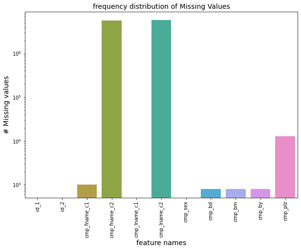

<div align="center">
  <p>
    <a align="center" href="" target="_blank">
      
    </a>
  </p>
  <br>

  <div align="center">
      <a href="https://github.com/tekboart/">
          
      </a>&nbsp;&nbsp;&nbsp;
      <a href="https://www.linkedin.com/in/kyan-bhr/">
          
      </a>&nbsp;&nbsp;&nbsp;
      <a href="https://scholar.google.com/citations?user=r3xmjQUAAAAJ&hl=en">
          
      </a>&nbsp;&nbsp;&nbsp;
      <a href="https://kaggle.com/">
          
      </a>&nbsp;&nbsp;&nbsp;
  </div>
</div>

<hr height="10">

# Recognition of duplicate records using BigData Analysis through Apache Spark


The BigData ML algorithms used:
- Classification
  1. Logistic Regression
  1. Linear SVM
  1. Random Forest

## Requirements


<!-- - Please refer to the file `requirements.txt` for a comprehesive list of packages and their corresponding version. -->

## Project Dir Structure
```bash
.
├── data
├── images
│   └── logos
├── logs
├── outputs
├── reports
└── utils

7 directories
```

## Data
The data was obtained from [here](https://archive.ics.uci.edu/ml/datasets/Record+Linkage+Comparison+Patterns) and was first used and introduced by Schmidtmann et al. [[1]](#1).

Dataset info:
- features
  1. id_1: internal identifier of first record.
  2. id_2: internal identifier of second record.
  3. cmp_fname_c1: agreement of first name, first component
  4. cmp_fname_c2: agreement of first name, second component
  5. cmp_lname_c1: agreement of family name, first component
  6. cmp_lname_c2: agreement of family name, second component
  7. cmp_sex: agreement sex
  8. cmp_bd: agreement of date of birth, day component
  9. cmp_bm: agreement of date of birth, month component
  10. cmp_by: agreement of date of birth, year component
  11. cmp_plz: agreement of postal code
  12. is_match: matching status (TRUE for matches, FALSE for non-matches)

## Contact
<!-- Unfortunately this repo is no longer actively maintained.  -->
Should you have any questions, feel free to contact TekBoArt @tekboart.

## Reference
<a id="1">[1]</a> Irene Schmidtmann, Gael Hammer, Murat Sariyar, Aslihan Gerhold-Ay: Evaluation des Krebsregisters NRW Schwerpunkt Record Linkage. Technical Report, IMBEI 2009.

## License
<!-- Creative Common Licenses -->
<!-- "Creative Commons Attribution-NonCommercial-ShareAlike (CC-BY-NC-SA)" -->
Shield: [![CC BY-NC-SA 4.0][cc-by-nc-sa-shield]][cc-by-nc-sa]

<!-- MIT License (can be used commercially) -->
<!-- Shield: [](https://opensource.org/licenses/MIT) -->

- Refer to the file `LICENSE` for more information regarding the license of this repository.

This work is licensed under a
[Creative Commons Attribution-NonCommercial-ShareAlike 4.0 International License][cc-by-nc-sa].

[![CC BY-NC-SA 4.0][cc-by-nc-sa-image]][cc-by-nc-sa]

[cc-by-nc-sa]: http://creativecommons.org/licenses/by-nc-sa/4.0/
[cc-by-nc-sa-image]: https://licensebuttons.net/l/by-nc-sa/4.0/88x31.png
[cc-by-nc-sa-shield]: https://img.shields.io/badge/License-CC%20BY--NC--SA%204.0-lightgrey.svg